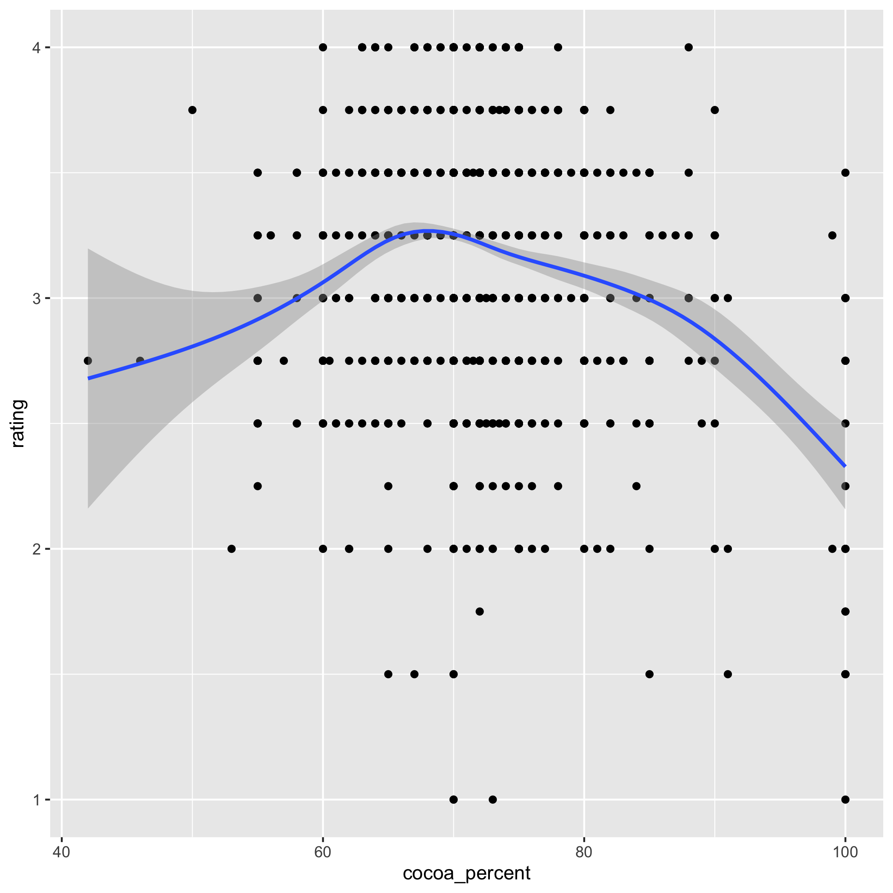
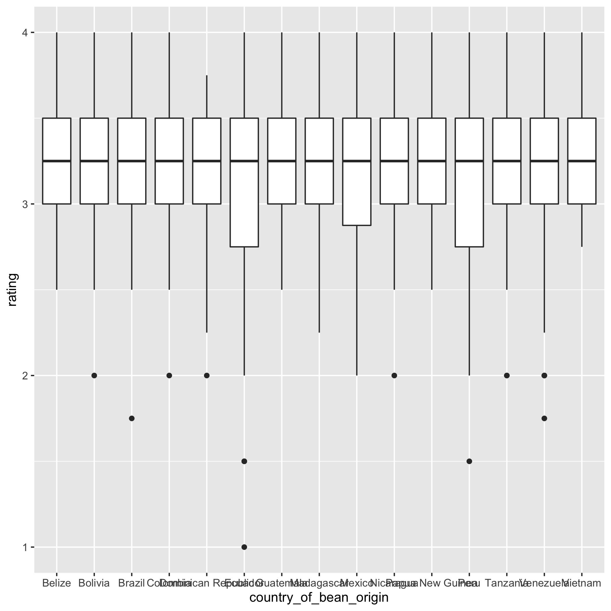
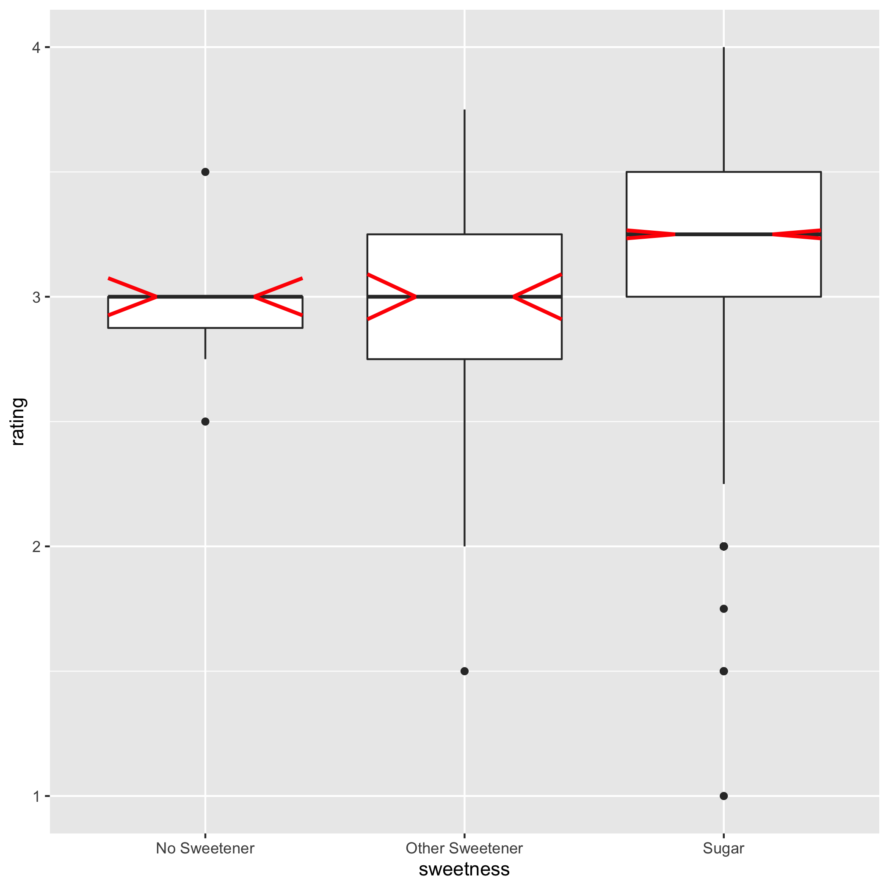
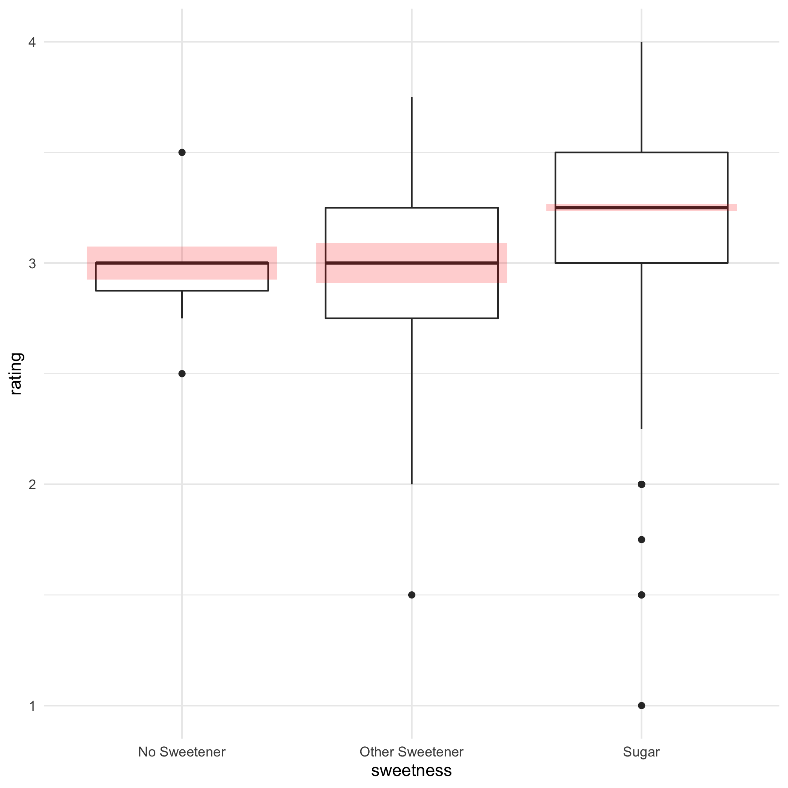
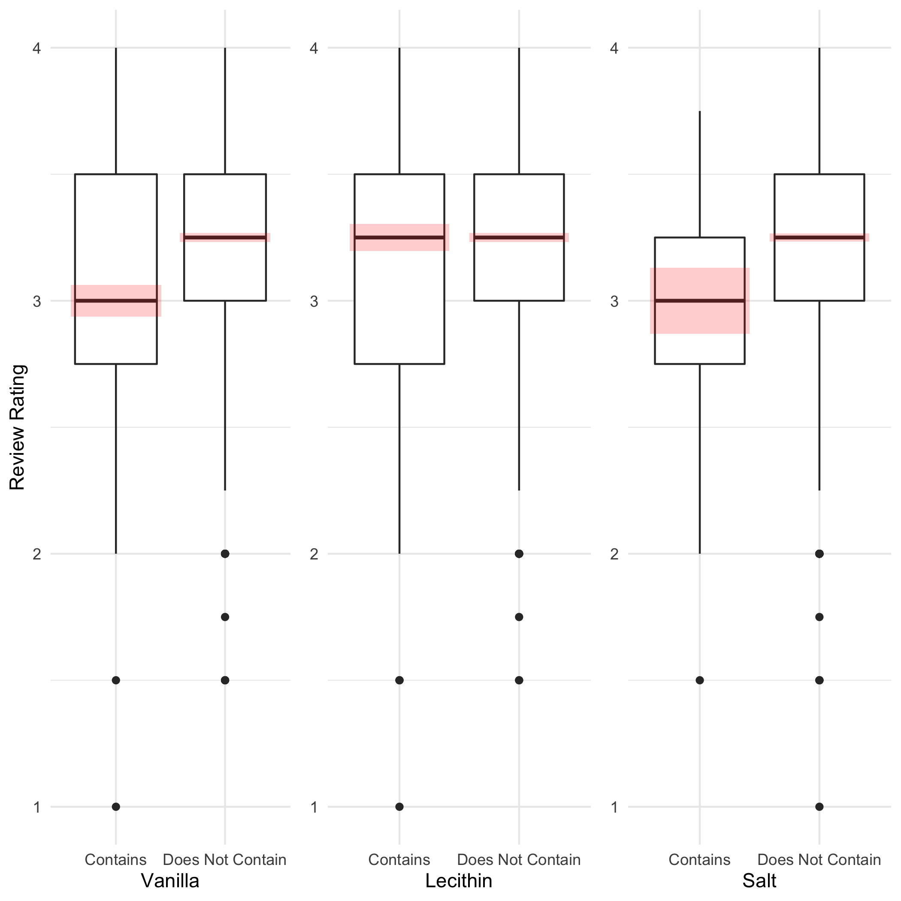
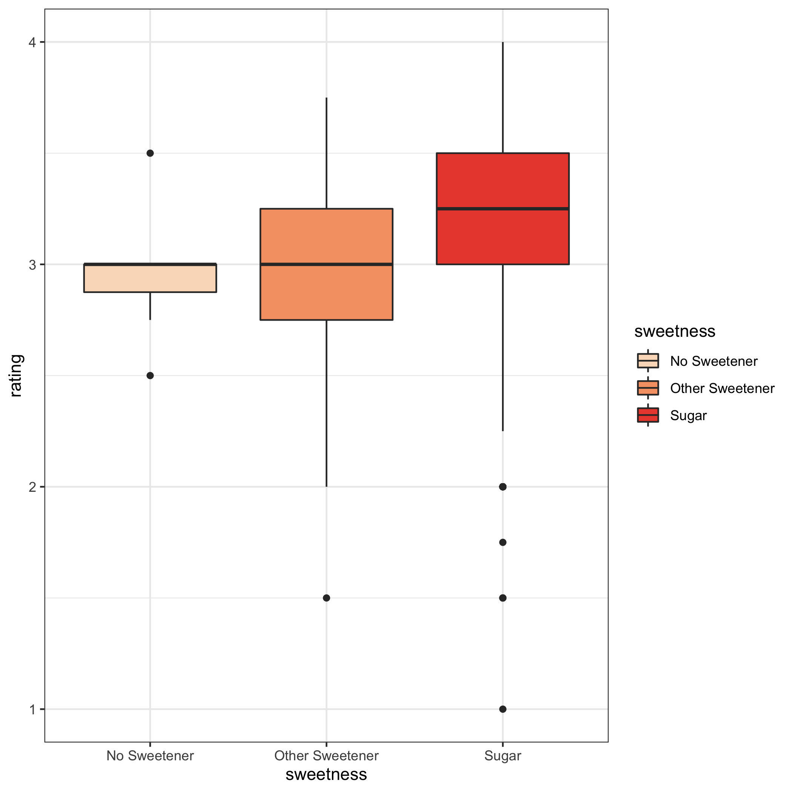
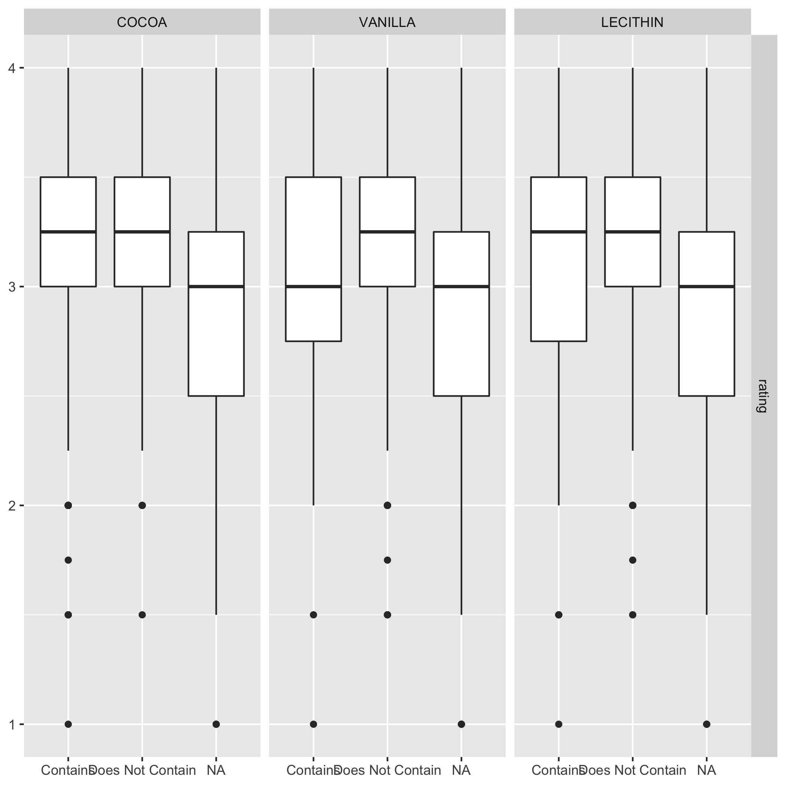

```r
library(tidyverse)
library(tidytuesdayR)
library(ggforce)
library(colorspace)
library(ggblanket)
```


Testing how md files created by spinr looks on github


```r
# Functions ----
add_notches_as_box <- function(plot, nudge = 0, alpha = 0.5) {
    gg_info <- ggplot2::ggplot_build(plot)$data[[1]]

    plot + ggplot2::geom_rect(data = gg_info, aes(
        xmin = xmin - nudge, xmax = xmax + nudge,
        ymin = notchlower, ymax = notchupper
        #,alpha = 1
    ), fill = "red", color = "transparent", alpha = alpha)
}

add_notches_as_lines <- function(plot, alpha = 1, size = 1, color = "red") {
    gg_info <- ggplot2::ggplot_build(plot)$data[[1]]

    plot + ggplot2::geom_segment(data = gg_info, aes(
        x = xmin, xend = (xmin + xid) / 2, y = notchupper, yend = middle,
        alpha = alpha
    ), colour = color, size = size) +
        ggplot2::geom_segment(data = gg_info, aes(
            x = xmin, xend = (xmin + xid) / 2, y = notchlower, yend = middle,
            alpha = alpha
        ), colour = color, size = size) +
        ggplot2::geom_segment(data = gg_info, aes(
            x = xmax, xend = (xmax + xid) / 2, y = notchupper, yend = middle,
            alpha = alpha
        ), colour = color, size = size) +
        ggplot2::geom_segment(data = gg_info, aes(
            x = xmax, xend = (xmax + xid) / 2, y = notchlower, yend = middle,
            alpha = alpha
        ), colour = color, size = size)
}

custom_boxplot <- function(data, x, y, nudge = 0.04, alpha = 0.2, xlab = NULL, ylab = NULL, title = NULL) { #nolint
    plot <- ggplot(data) +
        geom_boxplot(aes_string(x = x, y = y)) +
        xlab({{xlab}}) +
        ylab({{ylab}}) +
        ggtitle({{title}})

    plot <- add_notches_as_box(plot, nudge = nudge, alpha = alpha) +
        theme_minimal()

    return(plot)
}

# Load data ----
# tt <- tt_load("2022-01-18")

# tt

data <- readr::read_csv('https://raw.githubusercontent.com/rfordatascience/tidytuesday/master/data/2022/2022-01-18/chocolate.csv')
```

```
## Rows: 2530 Columns: 10
## ── Column specification ────────────────────────────────────────────────────────────────
## Delimiter: ","
## chr (7): company_manufacturer, company_location, country_of_bean_origin, specific_be...
## dbl (3): ref, review_date, rating
## 
## ℹ Use `spec()` to retrieve the full column specification for this data.
## ℹ Specify the column types or set `show_col_types = FALSE` to quiet this message.
```

```r
# Data cleaning ----
data <- data %>%
    mutate(cocoa_percent = as.numeric(str_remove_all(cocoa_percent, "%")))

data <- data %>%
    mutate(
        BEANS = if_else(stringr::str_detect(ingredients, "B"), "Contains", "Does Not Contain"),
        SUGAR = if_else((stringr::str_detect(ingredients, "S") &
                             !stringr::str_detect(ingredients, "\\*") &
                             !stringr::str_detect(ingredients, "\a")), TRUE, FALSE), # nolint
        SWEET = if_else(stringr::str_detect(ingredients, "S\\*"), TRUE, FALSE),
        COCOA = if_else(stringr::str_detect(ingredients, "C"), "Contains", "Does Not Contain"),
        VANILLA = if_else(stringr::str_detect(ingredients, "V"), "Contains", "Does Not Contain"),
        LECITHIN = if_else(stringr::str_detect(ingredients, "L"), "Contains", "Does Not Contain"),
        SALT = if_else(stringr::str_detect(ingredients, "Sa"), "Contains", "Does Not Contain"),
    ) %>%
    mutate(sweetness = case_when(
        SUGAR == FALSE & SWEET == FALSE ~ "No Sweetener",
        SUGAR == TRUE & SWEET == FALSE ~ "Sugar",
        SUGAR == FALSE & SWEET == TRUE ~ "Other Sweetener"
    ))

data_no_na <- data %>%
    drop_na()


data %>%
    select(where(is.character)) %>%
    map(fct_count, sort = TRUE, prop = TRUE)
```

```
## $company_manufacturer
## # A tibble: 580 × 3
##    f             n       p
##    <fct>     <int>   <dbl>
##  1 Soma         56 0.0221 
##  2 Fresco       39 0.0154 
##  3 Arete        32 0.0126 
##  4 Bonnat       30 0.0119 
##  5 A. Morin     26 0.0103 
##  6 Dandelion    25 0.00988
##  7 Pralus       25 0.00988
##  8 Domori       23 0.00909
##  9 Guittard     22 0.00870
## 10 Valrhona     22 0.00870
## # … with 570 more rows
## 
## $company_location
## # A tibble: 67 × 3
##    f               n      p
##    <fct>       <int>  <dbl>
##  1 U.S.A.       1136 0.449 
##  2 Canada        177 0.0700
##  3 France        176 0.0696
##  4 U.K.          133 0.0526
##  5 Italy          78 0.0308
##  6 Belgium        63 0.0249
##  7 Ecuador        58 0.0229
##  8 Australia      53 0.0209
##  9 Switzerland    44 0.0174
## 10 Germany        42 0.0166
## # … with 57 more rows
## 
## $country_of_bean_origin
## # A tibble: 62 × 3
##    f                      n      p
##    <fct>              <int>  <dbl>
##  1 Venezuela            253 0.1   
##  2 Peru                 244 0.0964
##  3 Dominican Republic   226 0.0893
##  4 Ecuador              219 0.0866
##  5 Madagascar           177 0.0700
##  6 Blend                156 0.0617
##  7 Nicaragua            100 0.0395
##  8 Bolivia               80 0.0316
##  9 Colombia              79 0.0312
## 10 Tanzania              79 0.0312
## # … with 52 more rows
## 
## $specific_bean_origin_or_bar_name
## # A tibble: 1,605 × 3
##    f                      n       p
##    <fct>              <int>   <dbl>
##  1 Madagascar            55 0.0217 
##  2 Ecuador               43 0.0170 
##  3 Peru                  41 0.0162 
##  4 Dominican Republic    38 0.0150 
##  5 Chuao                 28 0.0111 
##  6 Venezuela             21 0.00830
##  7 Kokoa Kamili          20 0.00791
##  8 Ghana                 17 0.00672
##  9 Papua New Guinea      17 0.00672
## 10 Sambirano             17 0.00672
## # … with 1,595 more rows
## 
## $ingredients
## # A tibble: 22 × 3
##    f                n       p
##    <fct>        <int>   <dbl>
##  1 3- B,S,C       999 0.395  
##  2 2- B,S         718 0.284  
##  3 4- B,S,C,L     286 0.113  
##  4 5- B,S,C,V,L   184 0.0727 
##  5 4- B,S,C,V     141 0.0557 
##  6 <NA>            87 0.0344 
##  7 2- B,S*         31 0.0123 
##  8 4- B,S*,C,Sa    20 0.00791
##  9 3- B,S*,C       12 0.00474
## 10 3- B,S,L         8 0.00316
## # … with 12 more rows
## 
## $most_memorable_characteristics
## # A tibble: 2,487 × 3
##    f                         n        p
##    <fct>                 <int>    <dbl>
##  1 creamy, nutty, cocoa      4 0.00158 
##  2 spicy, cocoa              4 0.00158 
##  3 cherry, rich choco        3 0.00119 
##  4 sandy, sweet              3 0.00119 
##  5 sandy, sweet, cocoa       3 0.00119 
##  6 sweet, marshmallow        3 0.00119 
##  7 sweet, vanilla, cocoa     3 0.00119 
##  8 basic cocoa               2 0.000791
##  9 brownie                   2 0.000791
## 10 cocoa, mild fruit         2 0.000791
## # … with 2,477 more rows
## 
## $BEANS
## # A tibble: 2 × 3
##   f            n      p
##   <fct>    <int>  <dbl>
## 1 Contains  2443 0.966 
## 2 <NA>        87 0.0344
## 
## $COCOA
## # A tibble: 3 × 3
##   f                    n      p
##   <fct>            <int>  <dbl>
## 1 Contains          1668 0.659 
## 2 Does Not Contain   775 0.306 
## 3 <NA>                87 0.0344
## 
## $VANILLA
## # A tibble: 3 × 3
##   f                    n      p
##   <fct>            <int>  <dbl>
## 1 Does Not Contain  2090 0.826 
## 2 Contains           353 0.140 
## 3 <NA>                87 0.0344
## 
## $LECITHIN
## # A tibble: 3 × 3
##   f                    n      p
##   <fct>            <int>  <dbl>
## 1 Does Not Contain  1950 0.771 
## 2 Contains           493 0.195 
## 3 <NA>                87 0.0344
## 
## $SALT
## # A tibble: 3 × 3
##   f                    n      p
##   <fct>            <int>  <dbl>
## 1 Does Not Contain  2406 0.951 
## 2 <NA>                87 0.0344
## 3 Contains            37 0.0146
## 
## $sweetness
## # A tibble: 4 × 3
##   f                   n       p
##   <fct>           <int>   <dbl>
## 1 Sugar            2360 0.933  
## 2 <NA>               87 0.0344 
## 3 Other Sweetener    76 0.0300 
## 4 No Sweetener        7 0.00277
```

```r
data %>%
    ggplot(aes(y = rating, x = cocoa_percent)) +
    geom_point() +
    geom_smooth()
```

```
## `geom_smooth()` using method = 'gam' and formula 'y ~ s(x, bs = "cs")'
```



```r
plot1_cocoa <- data %>%
    ggplot(aes(y = rating, x = cocoa_percent)) +
    geom_jitter(alpha = 0.5) +
    geom_smooth() +
    xlab("Cocoa Level (%)") +
    ylab("Review Rating") +
    ggtitle("How Does Cocoa Affect Review Rating?")

data %>%
    ggplot(aes(y = rating, x = cocoa_percent)) +
    geom_bin2d(bins = 12, alpha = 0.8) +
    scale_fill_continuous(type = "viridis") +
    # geom_jitter(alpha = 0.5, width = 1, height = 0.2) +
    geom_smooth()
```

```
## `geom_smooth()` using method = 'gam' and formula 'y ~ s(x, bs = "cs")'
```


```r
data %>%
    group_by(specific_bean_origin_or_bar_name) %>%
    mutate(med_rating = median(rating), n = n()) %>%
    arrange(desc(med_rating)) %>%
    select(specific_bean_origin_or_bar_name, med_rating, n)
```

```
## # A tibble: 2,530 × 3
## # Groups:   specific_bean_origin_or_bar_name [1,605]
##    specific_bean_origin_or_bar_name         med_rating     n
##    <chr>                                         <dbl> <int>
##  1 Pablino                                           4     1
##  2 La Joya                                           4     1
##  3 Guayas                                            4     1
##  4 Morobe                                            4     1
##  5 Coto Brus, Terciopelo                             4     1
##  6 Phantom                                           4     1
##  7 Bali, Sukrama Bros. Farm, Melaya, 62hr C          4     1
##  8 Rio Peripa H.                                     4     1
##  9 Maracaibo, El Rosario                             4     1
## 10 Madagascar, 100% criollo                          4     1
## # … with 2,520 more rows
```

```r
# Each bean doesn't have a lot of reviews
# Try something more general

top_countries <- data %>%
    group_by(country_of_bean_origin) %>%
    summarise(med_rating = median(rating), n = n()) %>%
    arrange(desc(med_rating)) %>%
    filter(n >= 50) %>%
    slice_max(med_rating, n = 5) %>%
    pull(country_of_bean_origin)

data %>%
    filter(country_of_bean_origin %in% top_countries) %>%
    ggplot(aes(x = country_of_bean_origin, y = rating)) +
    geom_boxplot()
```



```r
plot2 <- data_no_na %>%
    ggplot() +
    geom_boxplot(
        aes(y = rating, x = factor(sweetness)),
        fill = "#85e4ff", colour = "#000000",
        # varwidth = TRUE,
        outlier.shape = 21, outlier.size = 3, notch = FALSE)

add_notches_as_box(plot2, alpha = 0.4, nudge = 0)
```


```r
p1 <- data_no_na %>%
    ggplot() +
    geom_boxplot(aes(y = rating, x = sweetness))

add_notches_as_lines(p1)
```

```
## Warning: Using alpha for a discrete variable is not advised.
```



```r
add_notches_as_box(p1, nudge = 0.04, alpha = 0.2) +
    theme_minimal()
```



```r
R <- map(
    .x = list("sweetness", "VANILLA", "LECITHIN", "SALT"),
    .f = ~ custom_boxplot(data_no_na, y = "rating", x = .x,
        ylab = "Review Rating",
        xlab = stringr::str_to_title(string = .x)))

gridExtra::grid.arrange(grobs = R, ncols = 2)
```


```r
plot2_sweet <- custom_boxplot(data_no_na, x = "sweetness", y = "rating",
    xlab = "Type of Sweetnener", ylab = "Review Rating",
    title = "How Does Sweetener Affect Review Rating?")

p1 <- custom_boxplot(data_no_na, x = "VANILLA", y = "rating",
    xlab = "Vanilla", ylab = "Review Rating")

p2 <- custom_boxplot(data_no_na, x = "LECITHIN", y = "rating",
    xlab = "Lecithin")

p3 <- custom_boxplot(data_no_na, x = "SALT", y = "rating",
    xlab = "Salt")

gridExtra::grid.arrange(p1, p2, p3, nrow = 1, ncol = 3)
```



```r
# p <- data_no_na %>%
#     ggplot(aes(y = rating, x = sweetness, fill = sweetness)) +
#     geom_boxplot() +
#     scale_fill_brewer(palette = "Blues") +
#     theme_minimal()

# p2 <- data_no_na %>%
#     ggplot(aes(y = rating, x = BEANS)) +
#     geom_boxplot()

# p3 <- data_no_na %>%
#     ggplot(aes(y = rating, x = COCOA)) +
#     geom_boxplot()

# p4 <- data_no_na %>%
#     ggplot(aes(y = rating, x = VANILLA)) +
#     geom_boxplot()

# p5 <- data_no_na %>%
#     ggplot(aes(y = rating, x = LECITHIN)) +
#     geom_boxplot()

# p6 <- data_no_na %>%
#     ggplot(aes(y = rating, x = SALT)) +
#     geom_boxplot()

# gridExtra::grid.arrange(p1, p2, p3, p4, p5, p6, nrow = 2)
# # Not much info in BEANS, so removing that plot;
# # also not a lot of info in COCOA, and if its removed we will
# # have a nice 2x2 grid
# gridExtra::grid.arrange(p1, p4, p5, p6, nrow = 2)

data_no_na %>%
    ggplot(aes(y = rating, x = sweetness)) +
    geom_boxplot(aes(fill = sweetness)) +
    scale_fill_discrete_sequential("Peach") +
    theme_bw()
```



```r
data %>%
    ggplot(aes(y = rating)) +
    geom_boxplot(aes(y = .panel_y, x = .panel_x)) +
    facet_matrix(rows = vars(sweetness, BEANS), cols = vars(rating))
```


```r
ggplot(data) +
    geom_boxplot(aes(x = .panel_x, y = .panel_y, group = .panel_x)) +
    facet_matrix(rows = vars(rating), cols = vars(COCOA, VANILLA, LECITHIN))
```



```r
data %>%
    drop_na() %>%
    ggplot(aes(y = rating, x = reorder(reorder(ingredients, rating, FUN = var), rating, FUN = median))) + # nolint
    geom_boxplot()
```


```r
data %>%
 count(ingredients, sort = TRUE) %>%
 print(n = 22)
```

```
## # A tibble: 22 × 2
##    ingredients        n
##    <chr>          <int>
##  1 3- B,S,C         999
##  2 2- B,S           718
##  3 4- B,S,C,L       286
##  4 5- B,S,C,V,L     184
##  5 4- B,S,C,V       141
##  6 <NA>              87
##  7 2- B,S*           31
##  8 4- B,S*,C,Sa      20
##  9 3- B,S*,C         12
## 10 3- B,S,L           8
## 11 4- B,S*,C,V        7
## 12 1- B               6
## 13 5-B,S,C,V,Sa       6
## 14 4- B,S,C,Sa        5
## 15 4- B,S,V,L         5
## 16 6-B,S,C,V,L,Sa     4
## 17 3- B,S,V           3
## 18 4- B,S*,V,L        3
## 19 4- B,S*,C,L        2
## 20 2- B,C             1
## 21 3- B,S*,Sa         1
## 22 5- B,S,C,L,Sa      1
```

```r
data %>%
    count(ingredients, BEANS, sweetness, COCOA, VANILLA, LECITHIN, SALT)
```

```
## # A tibble: 22 × 8
##    ingredients BEANS    sweetness       COCOA            VANILLA    LECITHIN SALT      n
##    <chr>       <chr>    <chr>           <chr>            <chr>      <chr>    <chr> <int>
##  1 1- B        Contains No Sweetener    Does Not Contain Does Not … Does No… Does…     6
##  2 2- B,C      Contains No Sweetener    Contains         Does Not … Does No… Does…     1
##  3 2- B,S      Contains Sugar           Does Not Contain Does Not … Does No… Does…   718
##  4 2- B,S*     Contains Other Sweetener Does Not Contain Does Not … Does No… Does…    31
##  5 3- B,S,C    Contains Sugar           Contains         Does Not … Does No… Does…   999
##  6 3- B,S,L    Contains Sugar           Does Not Contain Does Not … Contains Does…     8
##  7 3- B,S,V    Contains Sugar           Does Not Contain Contains   Does No… Does…     3
##  8 3- B,S*,C   Contains Other Sweetener Contains         Does Not … Does No… Does…    12
##  9 3- B,S*,Sa  Contains Other Sweetener Does Not Contain Does Not … Does No… Cont…     1
## 10 4- B,S,C,L  Contains Sugar           Contains         Does Not … Contains Does…   286
## # … with 12 more rows
```

```r
data %>%
    select(BEANS, sweetness, COCOA, VANILLA, LECITHIN, SALT) %>%
    map(~ fct_count(as.factor(.x)))
```

```
## $BEANS
## # A tibble: 2 × 2
##   f            n
##   <fct>    <int>
## 1 Contains  2443
## 2 <NA>        87
## 
## $sweetness
## # A tibble: 4 × 2
##   f                   n
##   <fct>           <int>
## 1 No Sweetener        7
## 2 Other Sweetener    76
## 3 Sugar            2360
## 4 <NA>               87
## 
## $COCOA
## # A tibble: 3 × 2
##   f                    n
##   <fct>            <int>
## 1 Contains          1668
## 2 Does Not Contain   775
## 3 <NA>                87
## 
## $VANILLA
## # A tibble: 3 × 2
##   f                    n
##   <fct>            <int>
## 1 Contains           353
## 2 Does Not Contain  2090
## 3 <NA>                87
## 
## $LECITHIN
## # A tibble: 3 × 2
##   f                    n
##   <fct>            <int>
## 1 Contains           493
## 2 Does Not Contain  1950
## 3 <NA>                87
## 
## $SALT
## # A tibble: 3 × 2
##   f                    n
##   <fct>            <int>
## 1 Contains            37
## 2 Does Not Contain  2406
## 3 <NA>                87
```

```r
 data %>%
    tidyr::drop_na() %>%
    rename(SWEETNESS = sweetness) %>%
    select(rating, BEANS, SWEETNESS, COCOA, VANILLA, LECITHIN, SALT) %>%
    mutate(across(!rating, .fns = as.character)) %>%
    pivot_longer(!rating, names_to = "INGR", values_to = "value") %>%
    gg_boxplot(x = value, y = rating, facet = INGR)
```

```
## ℹ {ggblanket} converts unspecified titles using snakecase::to_sentence_case. Use titles = ~.x to leave unspecified titles as is, and/or specify individual titles manually using *_title arguments.
## ℹ {ggblanket} treats faceting as an aesthetic.
```

```
## Warning: Removed 42 rows containing non-finite values (stat_boxplot).
```


```r
path <- "plots/2022-01-18/"
ggplot2::ggsave(filename = paste0(path, "cocoa.pdf"), plot = plot1_cocoa)
```

```
## Saving 7 x 7 in image
## `geom_smooth()` using method = 'gam' and formula 'y ~ s(x, bs = "cs")'
```

```r
ggplot2::ggsave(filename = paste0(path, "sweetness.pdf"), plot = plot2_sweet)
```

```
## Saving 7 x 7 in image
```

```r
pl3 <- gridExtra::arrangeGrob(p1, p2, p3, nrow = 1, ncol = 3, top = "Effect of Various Ingredients on Review Rating")
ggplot2::ggsave(filename = paste0(path, "ingredients.pdf"), plot = pl3)
```

```
## Saving 7 x 7 in image
```

```r
for(name in c("cocoa", "sweetness", "ingredients")) {
    pdftools::pdf_convert(
        pdf = glue::glue("{path}{name}.pdf"),
        filenames = glue::glue("{path}{name}.png"),
        format = "png", dpi = 450)
}
```

```
## Warning in sprintf(filenames, pages, format): 2 arguments not used by format 'plots/
## 2022-01-18/cocoa.png'
```

```
## Converting page 1 to plots/2022-01-18/cocoa.png...
```

```
## PDF error: Couldn't find a font for 'Helvetica'
## PDF error: Couldn't find a font for 'Helvetica'
## PDF error: Couldn't find a font for 'Helvetica'
## PDF error: Couldn't find a font for 'Helvetica'
## PDF error: Couldn't find a font for 'Helvetica'
## PDF error: Couldn't find a font for 'Helvetica'
## PDF error: Couldn't find a font for 'Helvetica'
## PDF error: Couldn't find a font for 'Helvetica'
## PDF error: Couldn't find a font for 'Helvetica'
## PDF error: Couldn't find a font for 'Helvetica'
## PDF error: Couldn't find a font for 'Helvetica'
```

```
##  done!
```

```
## Warning in sprintf(filenames, pages, format): 2 arguments not used by format 'plots/
## 2022-01-18/sweetness.png'
```

```
## Converting page 1 to plots/2022-01-18/sweetness.png...
```

```
## PDF error: Couldn't find a font for 'Helvetica'
## PDF error: Couldn't find a font for 'Helvetica'
## PDF error: Couldn't find a font for 'Helvetica'
## PDF error: Couldn't find a font for 'Helvetica'
## PDF error: Couldn't find a font for 'Helvetica'
## PDF error: Couldn't find a font for 'Helvetica'
## PDF error: Couldn't find a font for 'Helvetica'
## PDF error: Couldn't find a font for 'Helvetica'
## PDF error: Couldn't find a font for 'Helvetica'
## PDF error: Couldn't find a font for 'Helvetica'
```

```
##  done!
```

```
## Warning in sprintf(filenames, pages, format): 2 arguments not used by format 'plots/
## 2022-01-18/ingredients.png'
```

```
## Converting page 1 to plots/2022-01-18/ingredients.png...
```

```
## PDF error: Couldn't find a font for 'Helvetica'
## PDF error: Couldn't find a font for 'Helvetica'
## PDF error: Couldn't find a font for 'Helvetica'
## PDF error: Couldn't find a font for 'Helvetica'
## PDF error: Couldn't find a font for 'Helvetica'
## PDF error: Couldn't find a font for 'Helvetica'
## PDF error: Couldn't find a font for 'Helvetica'
## PDF error: Couldn't find a font for 'Helvetica'
## PDF error: Couldn't find a font for 'Helvetica'
## PDF error: Couldn't find a font for 'Helvetica'
## PDF error: Couldn't find a font for 'Helvetica'
## PDF error: Couldn't find a font for 'Helvetica'
## PDF error: Couldn't find a font for 'Helvetica'
## PDF error: Couldn't find a font for 'Helvetica'
## PDF error: Couldn't find a font for 'Helvetica'
## PDF error: Couldn't find a font for 'Helvetica'
## PDF error: Couldn't find a font for 'Helvetica'
## PDF error: Couldn't find a font for 'Helvetica'
## PDF error: Couldn't find a font for 'Helvetica'
## PDF error: Couldn't find a font for 'Helvetica'
## PDF error: Couldn't find a font for 'Helvetica'
## PDF error: Couldn't find a font for 'Helvetica'
## PDF error: Couldn't find a font for 'Helvetica'
```

```
##  done!
```

